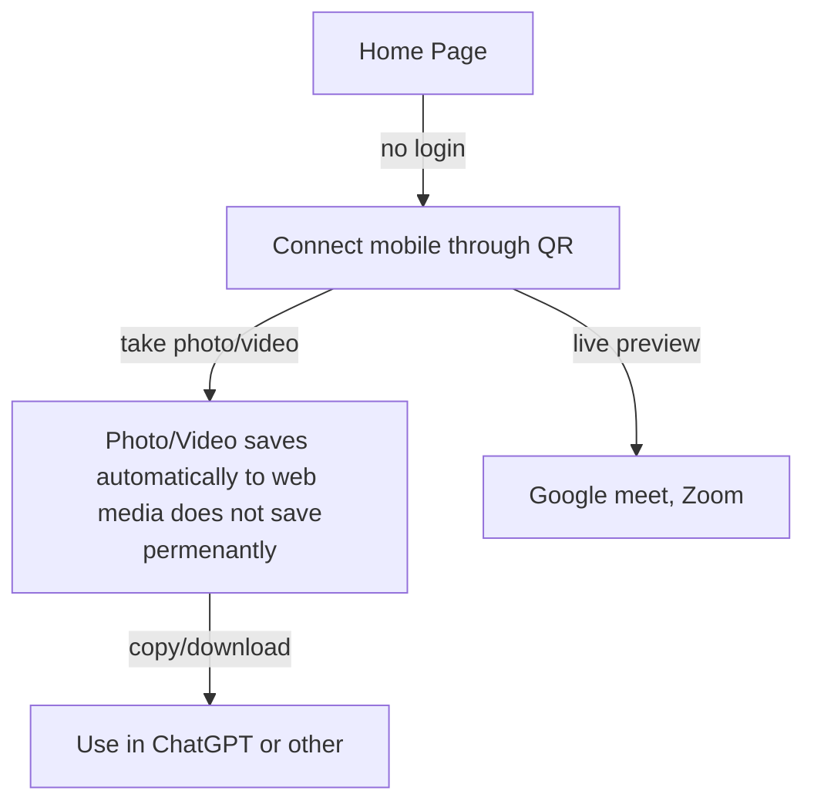

# CamConnectIt

CamConnectIt is a micro SaaS platform where users can use mobile phone cameras directly inside browsers with ease.

## BackStory

I have often felt the need to use a mobile phone camera for Google Meet because my laptop camera is not good enough. I am a university student, so I use ChatGPT and other LLMs extensively to study. Because most study materials are still physical paper, I need a better camera than on my laptop to take a photo and ask ChatGPT. That's why I thought of a simple and effective way to bridge this gap. Because I need this to be easily accessible, this will be a **web app**.

## User Workflow

## Competitor Analysis

Not yet done.

## Pitch

**CamConnectIt is a micro SaaS platform where users can use mobile phone cameras directly inside browsers with ease.**

## Must be
1. Simple and easy to use
2. No additional software needed to be installed
3. Smooth camera preview with high-quality feed
4. Media share should be instant
5. Must be able to copy media
6. The preview should be full screen so OBS Studio can make it a virtual camera

## Development

> Hadn't thought about it yet.
Development should not take more than a month.

Idealy first few days to analyze the project and design it. After that development and testing for two weeks. Finally marketing and reaching out.
The project should follow Agile methodology where each iteration builds a *simple complete loveable* (SLC) product.

 
